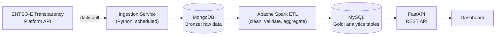

# GridPulse

**A European electricity market data engineering platform.**

GridPulse ingests day-ahead electricity prices (and, later, load and generation mix) for Greece and other European bidding zones from the [ENTSO-E Transparency Platform](https://transparency.entsoe.eu), processes them through a Bronze/Silver/Gold data pipeline, and serves them through a REST API and a dashboard. The whole system is containerized and designed for deployment on AWS.

> **Status:** early development. The ENTSO-E ingestion prototype works; the rest of the pipeline is in progress. See the [roadmap](#roadmap).

## Why this project

Greece's grid shows a clear "duck curve": on sunny days, day-ahead prices fall to roughly zero for hours around midday because of solar generation, then climb again in the evening. GridPulse is built to collect, store and expose this kind of data reliably, as an end-to-end exercise in data and software engineering.

## Architecture



Raw API responses land in MongoDB (Bronze), Spark cleans and aggregates them into MySQL (Gold), and FastAPI serves the Gold tables.

## Tech stack

Python · Apache Spark · MongoDB · MySQL · FastAPI · Docker / Docker Compose · GitHub Actions · AWS (planned)

## Getting started

**Prerequisites:** Python 3.10+ and an ENTSO-E API token. To get one, register at [transparency.entsoe.eu](https://transparency.entsoe.eu), then email `transparency@entsoe.eu` with the subject "Restful API access" and your registered address, and generate the token in your account settings once approved.

```bash
git clone https://github.com/GeoZann/gridpulse.git
cd gridpulse

python -m venv .venv
.venv\Scripts\activate          # Windows
# source .venv/bin/activate     # Linux / macOS

pip install -r requirements.txt

cp .env.example .env            # Windows: copy .env.example .env
# edit .env and set ENTSOE_API_TOKEN

python entsoe_hello_world.py
```

The script prints Greek day-ahead prices for the previous day, as hourly averages of the 15-minute market intervals.

## Roadmap

- [x] ENTSO-E API access and first ingestion prototype
- [ ] Repository structure and Docker Compose skeleton
- [ ] Ingestion service storing raw data in MongoDB (Bronze)
- [ ] Spark ETL into MySQL (Gold)
- [ ] REST API (FastAPI)
- [ ] Dashboard
- [ ] AWS deployment
- [ ] CI/CD with GitHub Actions
- [ ] Architecture documentation

## Data source

Market data comes from the ENTSO-E Transparency Platform. Check its terms of use before redistributing any derived data.

## Author

Georgios Zannis · [GitHub](https://github.com/GeoZann)