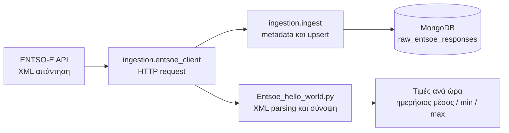

# GridPulse: Μαθαίνοντας να Σχεδιάζουμε μια Εφαρμογή Δεδομένων

## Έννοιες, τεχνολογίες και πρακτικές μέσα από ένα πραγματικό παράδειγμα

---

## Πώς να χρησιμοποιήσεις αυτόν τον οδηγό

Αυτός ο οδηγός δεν είναι κατάλογος συναρτήσεων ούτε σχολιασμός κάθε γραμμής κώδικα. Στόχος του είναι να εξηγήσει πώς προσεγγίζουμε την κατασκευή μιας εφαρμογής δεδομένων: πώς ξεκινάμε από ένα πρόβλημα, πώς ορίζουμε μικρά όρια ευθύνης, πώς επιλέγουμε εργαλεία, πώς σκεφτόμαστε αποτυχίες και πώς αποκτούμε εμπιστοσύνη με δοκιμές.

Το GridPulse λειτουργεί ως μελέτη περίπτωσης. Οι τεχνολογίες εξηγούνται πρώτα ως γενικές ιδέες και έπειτα συνδέονται με τα αρχεία του project. Οι αγγλικοί τεχνικοί όροι διατηρούνται όπου είναι χρήσιμοι, αλλά ο σκοπός δεν είναι να τους απομνημονεύσεις: είναι να καταλάβεις το πρόβλημα που λύνει κάθε τεχνική επιλογή και πότε θα άξιζε να επιλέξεις κάτι διαφορετικό.

> **Σημαντική διάκριση:** Ο οδηγός περιγράφει ό,τι υπάρχει τώρα: ένα prototype που ανακτά και εμφανίζει τιμές, και μία ροή ingestion που αποθηκεύει το ακατέργαστο XML στο MongoDB. Το Spark, η βάση Gold σε MySQL, το REST API, το dashboard, το AWS και ο αυτοματισμός εκτέλεσης είναι μελλοντικά στάδια, όχι λειτουργίες της σημερινής υλοποίησης.

## Περιεχόμενα

1. [Το πρόβλημα πριν από την τεχνολογία](#1-το-πρόβλημα-πριν-από-την-τεχνολογία)
2. [Αρχιτεκτονική: όρια και ευθύνες](#2-αρχιτεκτονική-όρια-και-ευθύνες)
3. [Από την ανάγκη σε ένα μικρό παραδοτέο](#3-από-την-ανάγκη-σε-ένα-μικρό-παραδοτέο)
4. [Γιατί χωρίζουμε τον κώδικα σε αρχεία και modules](#4-γιατί-χωρίζουμε-τον-κώδικα-σε-αρχεία-και-modules)
5. [Data engineering και Medallion Architecture](#5-data-engineering-και-medallion-architecture)
6. [Docker: ίδιο περιβάλλον, λιγότερες εκπλήξεις](#6-docker-ίδιο-περιβάλλον-λιγότερες-εκπλήξεις)
7. [Ρυθμίσεις, secrets και περιβάλλοντα](#7-ρυθμίσεις-secrets-και-περιβάλλοντα)
8. [Tests και επίπεδα εμπιστοσύνης](#8-tests-και-επίπεδα-εμπιστοσύνης)
9. [Ερωτήσεις που καθοδηγούν τις τεχνικές επιλογές](#9-ερωτήσεις-που-καθοδηγούν-τις-τεχνικές-επιλογές)
10. [Μελέτη περίπτωσης: οι τεχνολογίες στον κώδικα](#10-μελέτη-περίπτωσης-οι-τεχνολογίες-στον-κώδικα)
11. [Εκτέλεση και πειραματισμός](#11-εκτέλεση-και-πειραματισμός)
12. [Τι έχει υλοποιηθεί και τι μένει](#12-τι-έχει-υλοποιηθεί-και-τι-μένει)
13. [Ασκήσεις σκέψης](#13-ασκήσεις-σκέψης)
14. [Γλωσσάρι](#14-γλωσσάρι)

---

## 1. Το πρόβλημα πριν από την τεχνολογία

Το GridPulse είναι ένα έργο μηχανικής δεδομένων για την αγορά ηλεκτρικής ενέργειας. Ο μακροπρόθεσμος στόχος είναι να συλλέγει πραγματικά δεδομένα αγοράς από την επίσημη πλατφόρμα διαφάνειας του ENTSO-E, να τα οργανώνει και τελικά να τα διαθέτει για αναζήτηση και οπτικοποίηση.

Η σημερινή υλοποίηση αρχίζει σκόπιμα από μία μόνο περίπτωση: τις ελληνικές day-ahead τιμές ηλεκτρικής ενέργειας, για μία συγκεκριμένη τοπική ημερομηνία. Το ENTSO-E επιστρέφει XML. Αυτό μας δίνει την ευκαιρία να αντιμετωπίσουμε από νωρίς πρακτικά ζητήματα που συναντώνται σε πραγματικά συστήματα:

- εξωτερικό HTTP API και χειρισμό σφαλμάτων δικτύου,
- χρονικά διαστήματα και θερινή ώρα,
- XML με namespaces και μεταβλητή χρονική ανάλυση,
- αποθήκευση του αρχικού δεδομένου για μελλοντική επεξεργασία,
- ασφαλείς επαναλήψεις μιας εργασίας ingestion.

Πριν επιλέξουμε Python, MongoDB ή Docker, χρειάζεται να περιγράψουμε το αποτέλεσμα που θέλουμε: «Για μία ημερομηνία και μία bidding zone, πάρε την απάντηση της αγοράς και κράτησέ την έτσι ώστε να μπορούμε να την επεξεργαστούμε αργότερα».

Αυτός ο ορισμός μάς βοηθά να μην ξεκινήσουμε από τεχνολογία επειδή είναι δημοφιλής. Ξεκινάμε από είσοδο, έξοδο και περιορισμούς. Στην πρώτη έκδοση επιλέγουμε μία χώρα, ένα είδος δεδομένων και μία ημέρα. Αυτό δεν είναι τυχαίος περιορισμός· είναι τρόπος να παραδώσουμε και να ελέγξουμε μία πλήρη, μικρή ροή πριν επεκταθούμε.

Η σταδιακή εξέλιξη μειώνει το κόστος της αβεβαιότητας. Πρώτα αποδεικνύουμε ότι μπορούμε να λάβουμε δεδομένα. Μετά τα διατηρούμε σε Bronze. Μόνο όταν η αρχή της ροής είναι κατανοητή και επαναλήψιμη προσθέτουμε μετασχηματισμούς, αναλυτική βάση και υπηρεσίες που τα καταναλώνουν.

## 2. Αρχιτεκτονική: όρια και ευθύνες

Σήμερα υπάρχουν δύο συγγενικές, αλλά διαφορετικές διαδρομές: το αρχικό prototype αναλύει το XML και εμφανίζει σύνοψη, ενώ το ingestion job διατηρεί την πλήρη απάντηση στο MongoDB.



Το διάγραμμα δεν είναι μόνο μια λίστα προϊόντων. Δείχνει όρια ευθύνης: η πηγή παρέχει δεδομένα, ο client επικοινωνεί με την πηγή, το ingestion συντονίζει τη συλλογή και το MongoDB διατηρεί το αποτέλεσμα. Όταν κάθε τμήμα έχει σαφή ρόλο, μπορούμε να το αλλάξουμε ή να το ελέγξουμε χωρίς να ξαναγράψουμε ολόκληρη την εφαρμογή.

Η τρέχουσα υλοποίηση καλύπτει μόνο την αρχή της μεγάλης ροής. Το Spark, η MySQL, το API και το dashboard εμφανίζονται στην αρχιτεκτονική ως μελλοντικά συστατικά· δεν υπάρχουν ακόμη ως εκτελέσιμες υπηρεσίες.

Η ροή ingestion συνοπτικά:

1. Διαβάζει το token και τις ρυθμίσεις.
2. Επιλέγει την ημερομηνία που θα ζητήσει.
3. Μετατρέπει τα τοπικά μεσάνυχτα της Αθήνας σε UTC timestamps.
4. Ζητά τα δεδομένα A44 από το ENTSO-E.
5. Παίρνει την απάντηση ως raw XML.
6. Δημιουργεί ένα document με XML και metadata.
7. Το γράφει στο MongoDB με σταθερό `_id` και `upsert=True`.

Τα κύρια αρχεία είναι:

| Αρχείο | Ρόλος |
|---|---|
| [Entsoe_hello_world.py](../Entsoe_hello_world.py) | Το αρχικό εκτελέσιμο prototype, XML parser και εκτύπωση σύνοψης |
| [entsoe_client.py](../ingestion/entsoe_client.py) | Η επαναχρησιμοποιήσιμη επικοινωνία με το ENTSO-E API |
| [ingest.py](../ingestion/ingest.py) | CLI εργασία που γράφει την raw απάντηση στο MongoDB |
| [docker-compose.yml](../infra/docker-compose.yml) | Τοπική υπηρεσία MongoDB με Docker Compose |
| [test_ingest.py](../tests/test_ingest.py) | Focused unit tests με mocks |
| [requirements.txt](../requirements.txt) | Python dependencies |
| [.env.example](../.env.example) | Παράδειγμα τοπικών ρυθμίσεων χωρίς πραγματικό token |
| [README.md](../README.md) | Σύντομες οδηγίες εγκατάστασης και εκτέλεσης |

## 3. Από την ανάγκη σε ένα μικρό παραδοτέο

Ένας χρήσιμος τρόπος να ξεκινήσεις μια εφαρμογή είναι να γράψεις πρώτα το συμβόλαιό της, όχι τον κώδικα. Ένα συμβόλαιο περιγράφει τι μπαίνει, τι βγαίνει και ποιες ιδιότητες πρέπει να ισχύουν.

Για την πρώτη ροή του GridPulse:

| Ερώτηση σχεδιασμού | Απόφαση για την πρώτη έκδοση |
|---|---|
| Ποια είναι η είσοδος; | Ημερομηνία, bidding zone και token |
| Ποια είναι η έξοδος; | Raw XML από το ENTSO-E αποθηκευμένο στη MongoDB |
| Ποια είναι η μονάδα εργασίας; | Μία bidding zone και μία τοπική ημερομηνία |
| Τι δεν πρέπει να συμβεί σε retry; | Να δημιουργηθεί δεύτερο document για το ίδιο λογικό κλειδί |
| Τι κάνουμε σε HTTP αποτυχία; | Η εργασία αποτυγχάνει αντί να αποθηκεύσει μια ψευδή επιτυχία |
| Πώς ελέγχουμε την ημερομηνία; | Unit test που καλύπτει και αλλαγή DST |

Αυτό οδηγεί σε ένα μικρό **vertical slice**: μια διαδρομή που περνά από τα βασικά στρώματα του συστήματος, από το αίτημα μέχρι την αποθήκευση. Ένα μικρό vertical slice είναι συχνά πιο διδακτικό από το να δημιουργήσουμε πολλούς άδειους φακέλους ή υπηρεσίες που δεν συνεργάζονται ακόμη.

Πριν γράψεις κώδικα, προσπάθησε να σημειώσεις:

1. Ποιος ή τι θα χρησιμοποιήσει τη λειτουργία;
2. Ποια δεδομένα μπαίνουν και ποια βγαίνουν;
3. Ποια είναι τα αναμενόμενα failures;
4. Τι πρέπει να μένει αληθές όταν η λειτουργία επαναληφθεί;
5. Ποια μικρή δοκιμή θα αποδείκνυε ότι το βασικό σενάριο λειτουργεί;

Αν δεν μπορείς ακόμη να απαντήσεις, πιθανότατα χρειάζεται να περιορίσεις το scope ή να μάθεις περισσότερα για την εξωτερική πηγή πριν επιλέξεις αρχιτεκτονική.

## 4. Γιατί χωρίζουμε τον κώδικα σε αρχεία και modules

Ένα module είναι ένας χώρος οργάνωσης κώδικα με σχετική ευθύνη. Ο διαχωρισμός δεν γίνεται για να έχουμε «πολλά αρχεία», αλλά για να κρατάμε αλλαγές που εξελίσσονται για διαφορετικούς λόγους σε διαφορετικά σημεία.

Στο GridPulse:

- Ο client ξέρει πώς να μιλήσει με το ENTSO-E. Δεν χρειάζεται να ξέρει πώς οργανώνεται η MongoDB.
- Το ingestion job ξέρει τη σειρά των βημάτων και το πού αποθηκεύουμε. Δεν χρειάζεται να υλοποιεί HTTP parsing.
- Το `infra/` περιγράφει το τοπικό περιβάλλον εκτέλεσης, όχι κανόνες τιμών αγοράς.
- Το `tests/` περιέχει ελέγχους που προστατεύουν τη συμπεριφορά.
- Το README εξηγεί σε άνθρωπο πώς να εγκαταστήσει και να εκτελέσει το έργο.
- Το `requirements.txt` δηλώνει εξωτερικά Python packages που χρειάζεται ο κώδικας.

Αυτός ο διαχωρισμός περιορίζει το **coupling** (πόσο εξαρτάται το ένα κομμάτι από το άλλο) και αυξάνει το **cohesion** (πόσο σχετικά είναι τα πράγματα μέσα στο ίδιο κομμάτι). Ένα πρακτικό τεστ είναι: «Αν αλλάξει ο τρόπος αποθήκευσης, ποια αρχεία περιμένω να αγγίξω;» Αν η απάντηση είναι σχεδόν όλο το project, τα όρια μάλλον δεν είναι αρκετά καθαρά.

Απόφυγε την αντίθετη υπερβολή: μην προσθέτεις abstraction ή service επειδή απλώς μπορεί να χρειαστεί κάποτε. Ένα module γίνεται χρήσιμο όταν δίνει σαφή θέση σε μία ευθύνη ή κάνει μια εξάρτηση ευκολότερη να ελεγχθεί.

## 5. Data engineering και Medallion Architecture

Ένα data pipeline μεταφέρει δεδομένα από πηγές προς καταναλωτές, συχνά περνώντας από στάδια επικύρωσης και μετασχηματισμού. Η **Medallion Architecture** οργανώνει αυτά τα στάδια ως Bronze, Silver και Gold:

| Επίπεδο | Συνήθης ρόλος | Εφαρμογή στο σχέδιο GridPulse |
|---|---|---|
| Bronze | Διατηρεί δεδομένα κοντά στην πηγή και provenance | Raw ENTSO-E XML στο MongoDB, που έχει υλοποιηθεί |
| Silver | Καθαρίζει, ελέγχει και κανονικοποιεί δεδομένα | Μελλοντικός μετασχηματισμός με Spark |
| Gold | Παρέχει μοντέλα έτοιμα για αναλυτική χρήση | Μελλοντικοί συγκεντρωτικοί πίνακες σε MySQL |

Η αξία αυτών των επιπέδων δεν είναι τα ονόματα ή οι τρεις βάσεις δεδομένων. Είναι η διάκριση ανάμεσα σε «τι λάβαμε», «τι θεωρούμε καθαρό και έγκυρο» και «τι είναι βολικό για συγκεκριμένη χρήση». Για ένα μικρό project, αυτά μπορεί να είναι και διαφορετικοί φάκελοι ή πίνακες, όχι απαραίτητα διαφορετικές τεχνολογίες.

Γιατί κρατάμε Bronze; Επειδή οι μετασχηματισμοί αλλάζουν. Αν διατηρούμε την αρχική απάντηση, μπορούμε να ξανατρέξουμε έναν διορθωμένο parser χωρίς να ζητήσουμε ξανά τα ίδια δεδομένα από την πηγή. Το trade-off είναι ότι raw δεδομένα καταλαμβάνουν χώρο και συχνά χρειάζονται πολιτική διατήρησης, πρόσβασης και προστασίας.

## 6. Docker: ίδιο περιβάλλον, λιγότερες εκπλήξεις

Το Docker συσκευάζει μια διεργασία μαζί με το filesystem και τις βιβλιοθήκες που χρειάζεται για να εκτελεστεί. Η συσκευασία αυτή λέγεται **image**. Όταν ξεκινήσεις ένα image, δημιουργείται ένα **container**: μια απομονωμένη διεργασία με δικό της filesystem view, ρυθμίσεις δικτύου και όρια πόρων.

Το container δεν είναι εικονική μηχανή. Συνήθως μοιράζεται τον kernel του host λειτουργικού και απομονώνει τη διεργασία με μηχανισμούς του λειτουργικού. Αυτό το κάνει ελαφρύτερο από το να τρέχει ένα πλήρες guest operating system για κάθε υπηρεσία.

Γιατί χρησιμοποιούμε Docker σε ένα project σαν αυτό;

- Η MongoDB έχει συγκεκριμένη έκδοση και δεν χρειάζεται να εγκατασταθεί χειροκίνητα στο Windows host.
- Τα μέλη μιας ομάδας μπορούν να ξεκινούν παρόμοια υπηρεσία με την ίδια βασική ρύθμιση.
- Η βάση μπορεί να σταματήσει χωρίς να αλλάξει η εγκατάσταση του Python ή άλλων εφαρμογών στο host.
- Η περιγραφή του service γίνεται επαναλήψιμη και ελέγξιμη μέσα σε αρχείο.

Το **Docker Compose** είναι εργαλείο για να περιγράψεις και να χειριστείς μαζί ένα ή περισσότερα Docker services. Στο [docker-compose.yml](../infra/docker-compose.yml) ορίζουμε το MongoDB image, δημοσιεύουμε την πόρτα `27017` και συνδέουμε named volume για να διατηρούνται τα δεδομένα.

Μερικοί όροι που αξίζει να ξεχωρίζεις:

- **Port mapping:** το `27017:27017` συνδέει μια θύρα του host με μια θύρα του container. Επιτρέπει στο Python που τρέχει στα Windows να συνδεθεί στο `localhost:27017`.
- **Volume:** αποθηκεύει δεδομένα έξω από τον κύκλο ζωής του container. Αν αφαιρεθεί το container, η βάση δεν χρειάζεται να χαθεί.
- **Service name / DNS:** μέσα σε ένα Compose network, containers βρίσκουν το ένα το άλλο με το service name. Άρα Python μέσα σε άλλο container θα χρησιμοποιούσε συνήθως `mongodb`, ενώ Python στο host χρησιμοποιεί `localhost`.
- **Compose file:** δηλώνει πώς ξεκινά η υπηρεσία. Δεν εγκαθιστά το Docker engine και δεν εγγυάται ότι η υπηρεσία ξεκίνησε επιτυχώς.

Στο σημερινό project, μόνο η MongoDB τρέχει σε container. Η Python εργασία τρέχει απευθείας στο host. Αυτό είναι απολύτως θεμιτό για τοπική ανάπτυξη και απλούστερο στην πρώτη φάση. Δεν χρειάζεται να βάλουμε κάθε διεργασία σε container πριν υπάρχει πραγματική ανάγκη.

Το Compose αρχείο εδώ είναι μόνο για ανάπτυξη: δεν έχει authentication, TLS, backups ή production network policy. Το Docker βοηθά στην αναπαραγωγιμότητα· από μόνο του δεν κάνει μια υπηρεσία ασφαλή ή production-ready.

## 7. Ρυθμίσεις, secrets και περιβάλλοντα

Ο πηγαίος κώδικας περιγράφει συμπεριφορά. Οι τιμές που αλλάζουν ανά περιβάλλον, όπως token, διεύθυνση βάσης ή zone, δίνονται ως **configuration**. Έτσι δεν χρειάζεται να τροποποιούμε και να ξαναχτίζουμε τον κώδικα για κάθε υπολογιστή.

Ένα **secret** είναι ειδικό είδος configuration που δίνει πρόσβαση ή εξουσία, όπως το ENTSO-E token ή ένας database password. Δεν πρέπει να αποθηκεύεται σε Git, να τυπώνεται σε logs ή να μπαίνει σε screenshot. Το `.env.example` δείχνει ποιες μεταβλητές αναμένονται με κενές ή ασφαλείς τιμές· το προσωπικό `.env` περιέχει τις πραγματικές τιμές και αγνοείται από το `.gitignore`.

Στο συγκεκριμένο setup η Python τρέχει στο host, άρα το Mongo URI είναι `mongodb://localhost:27017`. Αν αργότερα τρέχει ως Compose service, η διεύθυνση θα αλλάξει σε `mongodb://mongodb:27017`. Η διαφορά αυτή δεν είναι αυθαίρετη: το `localhost` σημαίνει «αυτό το ίδιο network namespace», όχι «ο υπολογιστής όπου τρέχει γενικά το σύστημα».

Καλή πρακτική είναι η εφαρμογή να διαβάζει ρυθμίσεις από ένα σαφές σημείο εκκίνησης και να αποτυγχάνει με κατανοητό μήνυμα όταν λείπει υποχρεωτική τιμή. Επίσης, να διαχωρίζεις τις σταθερές προεπιλογές από τα μυστικά και να αποφεύγεις να διαβάζεις configuration πολύ νωρίς, πριν φορτωθούν οι τιμές του περιβάλλοντος.

## 8. Tests και επίπεδα εμπιστοσύνης

Δεν υπάρχει ένα test που να αποδεικνύει ότι μια κατανεμημένη εφαρμογή «δουλεύει». Χρησιμοποιούμε επίπεδα ελέγχου, από τα μικρά και γρήγορα έως τα πιο ρεαλιστικά και ακριβά:

1. **Unit test:** ελέγχει μία μικρή μονάδα με τις εξωτερικές εξαρτήσεις αντικατεστημένες. Είναι γρήγορο και εντοπίζει λάθη στη δική μας λογική.
2. **Integration test:** ελέγχει ότι δύο ή περισσότερα πραγματικά συστατικά συνεργάζονται, π.χ. ότι ο κώδικας γράφει στη MongoDB.
3. **End-to-end test:** εκτελεί ολόκληρη τη ροή με πραγματικές ή αντιπροσωπευτικές εξαρτήσεις, από request μέχρι αποθήκευση.

Στα unit tests του project κάνουμε mock το HTTP και το Mongo collection. Έτσι μπορούμε να ελέγξουμε την UTC μετατροπή, το `ENTSOE_DOMAIN` και το σχήμα της εγγραφής χωρίς token, Internet ή ενεργό Docker. Αυτό αυξάνει την ταχύτητα και τη σταθερότητα των tests, αλλά δημιουργεί ένα όριο: ένα mock δεν μπορεί να αποδείξει ότι η πραγματική MongoDB δέχεται τη σύνδεση ή ότι το πραγματικό API επιστρέφει το XML που περιμένουμε.

Μια καλή δοκιμή στοχεύει συμπεριφορά που έχει σημασία για τον χρήστη ή το σύστημα. Δεν χρειάζεται να ελέγχει κάθε εσωτερική γραμμή κώδικα. Για κάθε test ρώτα: «Αν αυτό αποτύχει, ποια λανθασμένη συμπεριφορά θα εντοπίσω;» Αν δεν υπάρχει σαφής απάντηση, ίσως το test είναι υπερβολικά δεμένο με την υλοποίηση.

## 9. Ερωτήσεις που καθοδηγούν τις τεχνικές επιλογές

Όταν προσθέτεις ένα νέο κομμάτι σε εφαρμογή όπως το GridPulse, μια χρήσιμη σειρά σκέψης είναι:

1. **Ποιο πρόβλημα λύνουμε και για ποιον;** Απόφυγε να ξεκινήσεις με «ας βάλω Kubernetes/Spark» πριν οριστεί η ανάγκη.
2. **Ποια είναι τα όρια του πρώτου παραδοτέου;** Μία ζώνη και μία ημέρα είναι πιο εύκολο να επαληθευτούν από όλη την Ευρώπη.
3. **Ποιες είναι οι είσοδοι, έξοδοι και invariants;** Στο ingestion, το λογικό κλειδί δεν πρέπει να δημιουργεί διπλότυπα σε επανάληψη.
4. **Πού μπορεί να αποτύχει;** Δίκτυο, credentials, αλλαγή XML schema, κλειστή MongoDB.
5. **Πώς θα παρατηρήσουμε το αποτέλεσμα;** Μήνυμα επιτυχίας, logs χωρίς secrets, και δυνατότητα ελέγχου του αποθηκευμένου document.
6. **Ποιο είναι το μικρότερο χρήσιμο test;** Mocked HTTP για request semantics· πραγματική MongoDB για integration behavior.
7. **Ποια επιλογή θα είναι δύσκολο να αλλάξει αργότερα;** Schema, identity key, διατήρηση ιστορικού, πολιτική retry.
8. **Μήπως προσθέτουμε τεχνολογία πριν χρειαστεί;** Κάθε service και database προσθέτει λειτουργικό κόστος, όχι μόνο δυνατότητες.

Αυτές οι ερωτήσεις δεν αντικαθιστούν την εμπειρία. Βοηθούν να κάνεις τις παραδοχές ρητές, ώστε να μπορείς να τις δοκιμάσεις, να τις συζητήσεις και να τις αλλάξεις όταν αλλάξουν οι ανάγκες.

## 10. Μελέτη περίπτωσης: οι τεχνολογίες στον κώδικα

Τα κεφάλαια που ακολουθούν είναι το συγκεκριμένο παράδειγμα πάνω στο οποίο εφαρμόστηκαν οι προηγούμενες αρχές. Δεν είναι ο ορισμός των τεχνολογιών: είναι ένας τρόπος να δεις τις ιδέες σε πραγματικές αποφάσεις και αρχεία.

### A.1 Το πρώτο prototype: από HTTP σε ημερήσια σύνοψη

Το [Entsoe_hello_world.py](../Entsoe_hello_world.py) είναι το πρώτο end-to-end πείραμα. Κάνει request, διαβάζει XML, υπολογίζει τιμές και τις τυπώνει. Δεν χρειάζεται MongoDB για να δείξει ότι το API μπορεί να χρησιμοποιηθεί.

#### Η μορφή της απάντησης

Το XML του ENTSO-E οργανώνει τα δεδομένα ιεραρχικά. Σε απλουστευμένη μορφή:

```text
Publication_MarketDocument
└── TimeSeries
    └── Period
        ├── timeInterval (start, end)
        ├── resolution
        └── Point
            ├── position
            └── price.amount
```

Ένα `TimeSeries` μπορεί να περιέχει ένα ή περισσότερα `Period`. Κάθε περίοδος προσδιορίζει το χρονικό της εύρος και το βήμα μέτρησης. Τα `Point` δίνουν θέσεις μέσα στην περίοδο και τις αντίστοιχες τιμές.

Το XML χρησιμοποιεί namespace. Στον κώδικα, το namespace URI αντιστοιχίζεται στο σύντομο πρόθεμα `ns`. Γι' αυτό οι αναζητήσεις μοιάζουν με `ns:TimeSeries` και όχι απλώς `TimeSeries`. Αν παραλειφθεί το namespace, το `ElementTree` δεν βρίσκει τα στοιχεία, παρότι υπάρχουν στο αρχείο.

#### Ανάλυση χρονικής ανάλυσης

Η `parse_resolution(text)` μετατρέπει συμβολοσειρές όπως `PT15M`, `PT60M` ή `PT1H` σε `timedelta`. Το `PT15M` σημαίνει δεκαπέντε λεπτά και το `PT1H` μία ώρα.

Αυτό είναι σημαντικό επειδή δεν πρέπει να υποθέτουμε ότι κάθε απάντηση έχει ωριαία ανάλυση. Ο parser χρησιμοποιεί τη resolution της κάθε περιόδου για να υπολογίσει πόσα σημεία χωρούν στο διάστημά της:

```text
πλήθος σημείων = (τέλος περιόδου - αρχή περιόδου) / χρονικό βήμα
```

Η `parse_utc(text)` μετατρέπει timestamps όπως `2026-09-26T21:00Z` σε `datetime` με ρητή ζώνη ώρας UTC. Η τελική μορφή του χρόνου είναι σημαντική: ένας χρόνος χωρίς timezone είναι αμφίσημος και μπορεί να ερμηνευθεί διαφορετικά σε διαφορετικά μηχανήματα.

#### Θέσεις και σημεία που παραλείπονται

Η `parse_prices(xml_text)` διατρέχει κάθε `TimeSeries` και κάθε `Period` χωριστά. Χρησιμοποιεί το start και το resolution της συγκεκριμένης περιόδου για να βρει την ώρα κάθε θέσης.

Το API μπορεί να παραλείψει ρητά ένα `Point` όταν η τιμή του είναι ίδια με την προηγούμενη, σύμφωνα με την καμπύλη δεδομένων. Ο parser κατασκευάζει dictionary από τις θέσεις που παρέχονται και περνά διαδοχικά από όλες τις θέσεις:

- Αν υπάρχει τιμή για τη θέση, τη χρησιμοποιεί.
- Αν η θέση παραλείπεται και υπάρχει προηγούμενη τιμή, την επαναχρησιμοποιεί (forward-fill).
- Αν δεν έχει εμφανιστεί ακόμη καμία τιμή, δεν μπορεί να κάνει forward-fill και δεν προσθέτει σημείο.

Η λειτουργία αυτή ανασυνθέτει τα σημεία που έχουν παραλειφθεί με αυτόν τον τρόπο. Δεν υποκαθιστά γενικό έλεγχο εγκυρότητας του XML ή των επιχειρησιακών δεδομένων.

#### Μετατροπή και σύνοψη

Ο prototype μετατρέπει κάθε timestamp σε `Europe/Athens` και κρατά τα σημεία των οποίων η τοπική ημερομηνία ταιριάζει με την ημερομηνία-στόχο. Έπειτα ομαδοποιεί τις τιμές ανά τοπική ώρα και τυπώνει ωριαίους μέσους, καθώς και μέσο, ελάχιστο και μέγιστο της ημέρας.

Αυτό είναι χρήσιμο για γρήγορη οπτική επιβεβαίωση, αλλά η εκτύπωση δεν είναι αποθήκευση ή αναλυτικό μοντέλο δεδομένων. Η ημερήσια σύνοψη επίσης δεν είναι το raw δεδομένο: είναι αποτέλεσμα υπολογισμού πάνω στα σημεία.

**Σημείο προσοχής:** Στην ημέρα αλλαγής από θερινή σε χειμερινή ώρα, μία τοπική ώρα εμφανίζεται δύο φορές. Η τρέχουσα ομαδοποίηση του prototype χρησιμοποιεί τον αριθμό της τοπικής ώρας, οπότε αυτές οι δύο εμφανίσεις μπορεί να καταλήξουν στην ίδια ωριαία ομάδα. Για ακριβείς αναλύσεις σε τέτοιες ημέρες θα χρειαστεί σαφής πολιτική για το `fold` ή ομαδοποίηση σε UTC και κατόπιν κατάλληλη παρουσίαση.

### A.2 Χρόνος, ζώνες ώρας και DST

Οι αγορές και τα API συχνά ορίζουν χρονικά παράθυρα σε UTC, αλλά ο χρήστης σκέφτεται ημερολογιακές ημέρες σε τοπική ώρα. Για την Ελλάδα, μία τοπική ημέρα δεν έχει πάντα 24 πραγματικές ώρες, λόγω DST (Daylight Saving Time, θερινή ώρα).

Η `request_window(target_day)` δημιουργεί δύο τοπικά μεσάνυχτα στη ζώνη `Europe/Athens`:

- αρχή: τα μεσάνυχτα της επιλεγμένης τοπικής ημερομηνίας,
- τέλος: τα μεσάνυχτα της επόμενης τοπικής ημερομηνίας.

Μετά η `to_api_time(value)` μετατρέπει κάθε timestamp σε UTC και το μορφοποιεί όπως ζητά το API (`YYYYMMDDHHmm`). Η ημερομηνία αυξάνεται ως ημερολογιακή ημέρα πριν από τη μετατροπή σε UTC. Έτσι, τα δύο UTC άκρα μπορεί να απέχουν 23, 24 ή 25 ώρες.

Παράδειγμα για την αλλαγή σε θερινή ώρα στις 29 Μαρτίου 2026:

| Όριο | Τοπική ώρα Αθήνας | UTC που στέλνεται στο API |
|---|---|---|
| Αρχή ημέρας | 2026-03-29 00:00, UTC+02:00 | 2026-03-28 22:00Z |
| Τέλος ημέρας | 2026-03-30 00:00, UTC+03:00 | 2026-03-29 21:00Z |

Το χρονικό διάστημα είναι 23 ώρες σε UTC, παρόλο που καλύπτει ακριβώς μία τοπική ημερολογιακή ημέρα. Αυτό είναι επιθυμητό: η ερώτηση προς το API αφορά την ελληνική μέρα, όχι ένα αυθαίρετο 24ωρο που ξεκινά σε UTC.

Η σχετική συμπεριφορά καλύπτεται από tests. Δες την `test_request_window_is_athens_local_calendar_day` και την `test_fetch_uses_utc_window_for_athens_dst_day` στο [test_ingest.py](../tests/test_ingest.py).

### A.3 Από το prototype σε επαναχρησιμοποιήσιμο client

Η επικοινωνία με το API βρίσκεται πλέον στο [ingestion/entsoe_client.py](../ingestion/entsoe_client.py). Ο διαχωρισμός έχει πρακτικό σκοπό: το κομμάτι που γνωρίζει HTTP και ENTSO-E μπορεί να χρησιμοποιηθεί από διαφορετικές εργασίες, χωρίς να αναμειγνύεται με τον κώδικα MongoDB ή την εκτύπωση σύνοψης.

#### Επιλογή bidding zone

Η `get_greece_domain()` διαβάζει τη μεταβλητή `ENTSOE_DOMAIN`. Αν δεν έχει οριστεί, χρησιμοποιεί το προεπιλεγμένο EIC `10YGR-HTSO-----Y`. Το domain περνά και στα `in_Domain` και `out_Domain`, ώστε το request να αφορά την ίδια ζώνη προσφοράς.

Η ανάγνωση της ρύθμισης γίνεται όταν καλείται η συνάρτηση, όχι μία φορά κατά το import του module. Έτσι, όταν το CLI φορτώσει πρώτα το `.env`, το request βλέπει την τιμή που μόλις φορτώθηκε.

#### Δημιουργία του request

Η `fetch_day_ahead_prices(token, target_day)`:

1. Υπολογίζει το τοπικό χρονικό παράθυρο.
2. Μετατρέπει τα άκρα σε UTC.
3. Δημιουργεί τα ENTSO-E query parameters, μεταξύ των οποίων `documentType=A44`.
4. Κάνει HTTP GET με timeout 30 δευτερολέπτων.
5. Καλεί `raise_for_status()` ώστε οι HTTP αποτυχίες να μη φαίνονται σαν επιτυχημένες απαντήσεις.
6. Επιστρέφει το `response.text`, δηλαδή το αρχικό XML.

Το token περνά στη βιβλιοθήκη `requests` ως query parameter `securityToken`. Γι' αυτό δεν πρέπει να τυπώνεται ή να καταγράφεται ολόκληρο το URL του request σε logs.

Ο client δεν αναλύει το XML και δεν γράφει στη βάση. Αυτή η διάκριση κάνει σαφές ποιο module είναι υπεύθυνο για κάθε λειτουργία.

### A.4 Bronze: αποθήκευση της αρχικής απάντησης

Στην αρχιτεκτονική Medallion, το Bronze είναι το επίπεδο όπου διατηρούμε δεδομένα κοντά στην αρχική τους μορφή. Στο GridPulse η απάντηση XML αποθηκεύεται αυτούσια. Αυτό επιτρέπει μελλοντική επανεπεξεργασία αν αλλάξουν οι κανόνες parsing ή τα σχήματα των downstream δεδομένων.

#### Επιλογή εγγράφου

Η `store_raw_response(collection, target_day, raw_xml)` κατασκευάζει ένα MongoDB document με τα παρακάτω πεδία:

| Πεδίο | Περιεχόμενο | Γιατί αποθηκεύεται |
|---|---|---|
| `_id` | `A44:<domain>:<YYYY-MM-DD>` | Σταθερή ταυτότητα για το συγκεκριμένο είδος, ζώνη και ημερομηνία |
| `document_type` | `A44` | Αναγνωρίζει το είδος δεδομένων ENTSO-E |
| `bidding_zone` | EIC της ζώνης | Καταγράφει σε ποια αγορά αφορά η απάντηση |
| `requested_date` | Ημερομηνία Αθήνας | Κρατά την ημερομηνία όπως την επέλεξε η εργασία |
| `requested_period` | UTC start/end και όνομα timezone | Επιτρέπει να ανασυνθέσουμε ποιο ακριβώς χρονικό παράθυρο ζητήθηκε |
| `fetched_at` | UTC datetime | Καταγράφει πότε έγινε η λήψη |
| `raw_xml` | Πλήρες σώμα απόκρισης | Διατηρεί το αρχικό υλικό για audit ή επεξεργασία αργότερα |

Τα `start_utc`, `end_utc` και `fetched_at` είναι Python `datetime` με timezone. Ο PyMongo τα αποθηκεύει ως BSON datetimes σε UTC.

#### Idempotency και upsert

Μια εργασία ingestion μπορεί να χρειαστεί να ξανατρέξει: για παράδειγμα, επειδή απέτυχε μετά τη λήψη ή επειδή θέλουμε να ανανεώσουμε τη συγκεκριμένη ημέρα. Το επιθυμητό αποτέλεσμα είναι η επανάληψη να μην δημιουργεί δεύτερο document για το ίδιο λογικό κλειδί.

Το `_id` προκύπτει από τρία στοιχεία:

```text
τύπος εγγράφου : bidding zone : τοπική ημερομηνία
```

Η γραμμή εγγραφής είναι ουσιαστικά:

```python
collection.replace_one({"_id": record_id}, document, upsert=True)
```

Το `upsert=True` σημαίνει: αν βρεθεί document με αυτό το `_id`, αντικατάστησέ το· αν δεν βρεθεί, δημιούργησέ το. Το MongoDB επιβάλλει μοναδικότητα στο `_id`, οπότε η ταυτότητα αυτή είναι και ο μηχανισμός αποφυγής διπλοεγγραφών.

Η τρέχουσα συμπεριφορά κρατά την τελευταία ληφθείσα έκδοση για μία ημερομηνία. Δεν κρατά ιστορικό πολλών fetches της ίδιας ημέρας. Αν αργότερα χρειαστεί audit όλων των προσπαθειών, θα πρέπει να σχεδιαστεί διαφορετικό κλειδί ή ξεχωριστή collection για τα fetch events.

#### Το CLI και η σειρά εκτέλεσης

Η `main()` στο [ingest.py](../ingestion/ingest.py) είναι ο συντονιστής της εργασίας:

1. Φορτώνει μεταβλητές από το `.env` με `load_dotenv()`.
2. Διαβάζει προαιρετικό `--date YYYY-MM-DD`. Αν δεν δοθεί, επιλέγει την προηγούμενη ημερομηνία στην Αθήνα.
3. Εισάγει το `MongoClient` όταν χρειάζεται, μέσα στο `main()`.
4. Διαβάζει το ENTSO-E token και το Mongo URI / όνομα βάσης.
5. Καλεί τον client για να πάρει XML.
6. Ανοίγει σύνδεση MongoDB ως context manager.
7. Γράφει στο `gridpulse.raw_entsoe_responses` και τυπώνει το ID και το μέγεθος της XML απάντησης.

Η καθυστερημένη εισαγωγή του `MongoClient` βοηθά τα unit tests: οι δοκιμές της λογικής του document δεν χρειάζονται εγκατεστημένο ή ενεργό MongoDB server.

### A.5 MongoDB και Docker Compose στην πράξη

Το [infra/docker-compose.yml](../infra/docker-compose.yml) περιγράφει μία υπηρεσία `mongodb` που βασίζεται στην επίσημη εικόνα `mongo:8`:

- Η θύρα `27017` του container δημοσιεύεται ως `localhost:27017` στον υπολογιστή.
- Το named volume `mongo_data` συνδέεται στο `/data/db`, όπου η MongoDB κρατά τα δεδομένα της.
- Το `restart: unless-stopped` ζητά από το Docker να επανεκκινεί την υπηρεσία μετά από συνηθισμένη διακοπή.

Η Python εργασία εκτελείται από το host, όχι μέσα σε container, γι' αυτό χρησιμοποιεί `mongodb://localhost:27017`. Αν αργότερα το ingestion γίνει και αυτό container σε κοινό Docker network, το hostname σύνδεσης θα πρέπει να είναι το service name, δηλαδή `mongodb`.

Το named volume διατηρεί τα δεδομένα όταν σταματάμε τα containers με `docker compose down`. Η εντολή `docker compose down -v` αφαιρεί και το volume, άρα διαγράφει τα τοπικά αποθηκευμένα δεδομένα. Χρησιμοποίησέ την μόνο όταν πράγματι θέλεις να καθαρίσεις τη βάση.

Αυτή η ρύθμιση προορίζεται για τοπική ανάπτυξη. Δεν ορίζει MongoDB authentication, backup policy, TLS ή production network restrictions. Δεν πρέπει να θεωρηθεί έτοιμη για έκθεση σε δημόσιο ή παραγωγικό περιβάλλον.

### A.6 Ρυθμίσεις και μυστικά στην πράξη

Το [.env.example](../.env.example) είναι πρότυπο. Αντέγραψέ το σε `.env` και συμπλήρωσε το token. Το πραγματικό `.env` βρίσκεται στο `.gitignore` και δεν πρέπει να γίνει commit.

Για την τοπική εκτέλεση, οι σχετικές ρυθμίσεις είναι:

| Μεταβλητή | Χρήση | Προεπιλογή / σημείωση |
|---|---|---|
| `ENTSOE_API_TOKEN` | Αυθεντικοποίηση στο ENTSO-E | Απαραίτητο, δεν πρέπει να δημοσιευθεί |
| `ENTSOE_DOMAIN` | EIC bidding zone | Προεπιλογή `10YGR-HTSO-----Y` |
| `MONGO_URI` | Σύνδεση από Python προς MongoDB | `mongodb://localhost:27017` για τοπική εκτέλεση από host |
| `MONGO_DB` | Όνομα βάσης | Προεπιλογή `gridpulse` |

Το `python-dotenv` διαβάζει τις τιμές από το `.env` όταν ξεκινά το CLI. Η εντολή εκτέλεσης δίνεται από τον ριζικό φάκελο του repository, όπως στα παραδείγματα παρακάτω.

### A.7 Tests: τι αποδεικνύουν και τι όχι

Τα tests βρίσκονται στο [tests/test_ingest.py](../tests/test_ingest.py) και χρησιμοποιούν `unittest` και `unittest.mock`. Το HTTP request αντικαθίσταται από mock response και το MongoDB collection από mock object. Έτσι δοκιμάζουμε τη λογική χωρίς πρόσβαση στο διαδίκτυο, token ή database server.

Τα τέσσερα tests καλύπτουν:

1. **`test_request_window_is_athens_local_calendar_day`:** Τα όρια της επιλεγμένης ημέρας δημιουργούνται στα μεσάνυχτα της Αθήνας και έχουν σωστό UTC offset πριν και μετά την αλλαγή θερινής ώρας.
2. **`test_fetch_uses_utc_window_for_athens_dst_day`:** Το request μεταφέρει τα σωστά UTC `periodStart` και `periodEnd` για την 29η Μαρτίου 2026.
3. **`test_fetch_uses_configured_bidding_zone`:** Η τιμή `ENTSOE_DOMAIN` από το environment χρησιμοποιείται και στα δύο domain parameters.
4. **`test_upserts_raw_xml_with_metadata_and_stable_identity`:** Το storage document διατηρεί XML και metadata, παράγει το ίδιο `_id` για την ίδια ημέρα και χρησιμοποιεί `replace_one(..., upsert=True)`.

Τα tests επιβεβαιώνουν το συμβόλαιο της λογικής μας· δεν επιβεβαιώνουν ότι:

- το πραγματικό token είναι έγκυρο,
- το ENTSO-E θα απαντήσει επιτυχώς,
- το XML του live API δεν έχει αλλάξει,
- το Docker Compose ξεκινά στο συγκεκριμένο μηχάνημα,
- η MongoDB δέχεται σύνδεση ή διατηρεί πράγματι το document στον δίσκο.

Για τα παραπάνω χρειάζεται end-to-end δοκιμή σε περιβάλλον με Docker και έγκυρο ENTSO-E token.

## 11. Εκτέλεση και πειραματισμός

Οι παρακάτω εντολές είναι για PowerShell από τον ριζικό φάκελο του repository.

### 11.1 Εγκατάσταση Python dependencies

```powershell
python -m venv .venv
.venv\Scripts\Activate.ps1
python -m pip install -r requirements.txt
```

Το `requirements.txt` περιλαμβάνει `requests` για HTTP, `tzdata` για timezone database σε περιβάλλοντα Windows όπου χρειάζεται, `python-dotenv` για `.env`, και `pymongo` για MongoDB.

### 11.2 Δημιουργία τοπικών ρυθμίσεων

```powershell
Copy-Item .env.example .env
```

Άνοιξε το `.env`, βάλε πραγματικό `ENTSOE_API_TOKEN` και επιβεβαίωσε ότι το `MONGO_URI` είναι `mongodb://localhost:27017`. Μην αντιγράψεις το token σε issue, log ή commit.

### 11.3 Εκκίνηση MongoDB και ingestion

```powershell
docker compose -f infra/docker-compose.yml up -d
python -m ingestion.ingest
```

Από προεπιλογή ζητείται η προηγούμενη τοπική ημερομηνία στην Αθήνα. Για συγκεκριμένη ημερομηνία:

```powershell
python -m ingestion.ingest --date 2026-09-27
```

Η επιτυχής εκτέλεση εμφανίζει το ID που γράφτηκε, το μέγεθος του raw XML σε χαρακτήρες και το όνομα της βάσης. Δεν εκτυπώνει ολόκληρο το XML ή το token.

### 11.4 Εκτέλεση tests και διακοπή MongoDB

```powershell
python -m unittest discover -s tests -v
docker compose -f infra/docker-compose.yml down
```

Το `down` σταματά και αφαιρεί τα containers αλλά κρατά το named volume. Για σκόπιμη διαγραφή και των τοπικών δεδομένων:

```powershell
docker compose -f infra/docker-compose.yml down -v
```

### 11.5 Εκτέλεση του αρχικού prototype

Το hello-world παραμένει διαθέσιμο χωριστά:

```powershell
python Entsoe_hello_world.py
```

Αυτή η εντολή κάνει fetch, parse και εκτύπωση σύνοψης. Δεν αποθηκεύει την απάντηση στο MongoDB. Για αποθήκευση χρησιμοποίησε το `python -m ingestion.ingest`.

## 12. Τι έχει υλοποιηθεί και τι μένει

### Γιατί κρατάμε raw XML;

Η αποθήκευση της αρχικής απάντησης δίνει δυνατότητα επανεπεξεργασίας χωρίς νέο API request. Αν βελτιωθεί ο parser, μπορούμε να ξαναδιαβάσουμε τα ήδη συλλεγμένα δεδομένα. Παράλληλα, το raw document προσφέρει ίχνος του τι απάντησε η πηγή.

### Γιατί η ταυτότητα περιλαμβάνει ημερομηνία και ζώνη;

Οι τιμές αλλάζουν ανά ημέρα και bidding zone. Αν το `_id` περιλάμβανε μόνο την ημερομηνία, δεδομένα από διαφορετικές ζώνες θα συγκρούονταν. Αν δεν περιλάμβανε ημερομηνία, κάθε fetch θα αντικαθιστούσε τα δεδομένα προηγούμενης ημέρας.

### Τι σημαίνει ότι η εργασία είναι idempotent;

Για το ίδιο λογικό κλειδί, η επανάληψη έχει το ίδιο τελικό αποτέλεσμα στη συλλογή αντί να προσθέτει άλλη εγγραφή. Εδώ αυτό επιτυγχάνεται με σταθερό `_id` και replace-upsert. Δεν σημαίνει ότι το εξωτερικό API δεν καλείται ξανά ή ότι η νέα απάντηση θα είναι byte-for-byte ίδια.

### Ποιοι περιορισμοί παραμένουν;

- Η υλοποίηση καλύπτει μόνο A44, δηλαδή day-ahead τιμές, για μία ζώνη κάθε φορά.
- Το raw XML αποθηκεύεται ως ένα document ανά ζώνη, τύπο και ημερομηνία. Νέα λήψη αντικαθιστά την προηγούμενη για το ίδιο κλειδί.
- Δεν υπάρχει retry/backoff policy για προσωρινά network/API errors.
- Δεν υπάρχει scheduler. Η εργασία εκτελείται χειροκίνητα.
- Η τοπική MongoDB δεν έχει authentication ή παραγωγικές ρυθμίσεις ασφαλείας.
- Δεν έχει επιβεβαιωθεί live end-to-end εκτέλεση σε Docker σε αυτό το περιβάλλον.
- Τα tests ελέγχουν τον κώδικα με mocks και όχι πραγματική αποθήκευση.

Οι περιορισμοί αυτοί είναι σκόπιμα ορατοί. Ένα μικρό, σαφές σύστημα είναι ευκολότερο να επαληθευτεί πριν προστεθούν περισσότερες υπηρεσίες.

### Τι ακολουθεί

Σύμφωνα με το [Project Plan](GridPulse-Project-Plan.md), η φυσική συνέχεια αφού επαληθευτεί τοπικά η ροή MongoDB είναι η επεξεργασία Bronze σε καθαρότερα δεδομένα. Η προτεινόμενη πορεία είναι:

1. Επιβεβαίωση με Docker ότι η λήψη γράφεται στη MongoDB και ότι δεύτερη εκτέλεση δεν δημιουργεί δεύτερο document.
2. Καθορισμός ελέγχων ποιότητας και μετασχηματισμών για ένα μικρό σύνολο πραγματικών ημερών.
3. Δημιουργία Silver/Gold ETL, με Spark και MySQL όταν είναι κατάλληλη η επόμενη φάση.
4. Έκθεση των Gold δεδομένων μέσω API και, αργότερα, dashboard.

Το Spark, το MySQL, το FastAPI, το dashboard, η ανάπτυξη σε AWS, το scheduling και το CI/CD δεν περιγράφονται εδώ ως υλοποιημένα. Είναι επόμενα ορόσημα του project.

## 13. Ασκήσεις σκέψης

1. **Άλλη ημερομηνία:** Τροποποίησε το test της `request_window` ώστε να ελέγχει και μια ημέρα χωρίς αλλαγή DST. Ποια είναι τότε η διαφορά μεταξύ των δύο UTC άκρων;
2. **Σταθερό κλειδί:** Γράψε με λόγια γιατί το `_id` περιλαμβάνει document type, zone και ημερομηνία. Τι σφάλμα θα προέκυπτε αν έλειπε ένα από αυτά;
3. **Νέα ζώνη:** Πώς θα έδινες διαφορετικό `ENTSOE_DOMAIN` χωρίς να αλλάξεις τον πηγαίο κώδικα; Ποιο test αποδεικνύει ότι αυτή η ρύθμιση λαμβάνεται υπόψη;
4. **Ιστορικό fetches:** Αν θέλαμε να κρατάμε κάθε προσπάθεια ingestion αντί να αντικαθιστούμε την προηγούμενη, ποια πεδία θα έπρεπε να αλλάξουν στο κλειδί και στο schema;
5. **Raw έναντι parsed:** Ποια είναι τα πλεονεκτήματα και το κόστος του να αποθηκεύουμε την αρχική XML απόκριση αντί μόνο των parsed τιμών;
6. **Integration test:** Σχεδίασε ένα test που ξεκινά πραγματική MongoDB και επιβεβαιώνει το document. Ποια εξάρτηση και ποια υποδομή χρειάζεται σε σχέση με τα υπάρχοντα unit tests;

## 14. Γλωσσάρι

| Όρος | Εξήγηση |
|---|---|
| **API** | Προγραμματιστική διεπαφή μέσω της οποίας ένα πρόγραμμα ζητά δεδομένα ή υπηρεσίες από άλλο σύστημα. |
| **A44** | Τύπος εγγράφου ENTSO-E για day-ahead τιμές. |
| **Bidding zone** | Περιοχή αγοράς ηλεκτρικής ενέργειας στην οποία αντιστοιχούν συγκεκριμένοι κανόνες και τιμές. |
| **Bronze layer** | Πρώτο επίπεδο αποθήκευσης, που κρατά τα δεδομένα όσο γίνεται πιο κοντά στην πηγή. |
| **CLI** | Command-Line Interface, διεπαφή εκτέλεσης προγράμματος από τερματικό. |
| **DST** | Daylight Saving Time, θερινή ώρα που αλλάζει το UTC offset μιας τοπικής ζώνης. |
| **EIC** | Energy Identification Code, κωδικός αναγνώρισης οντότητας/περιοχής στον ενεργειακό χώρο. |
| **Idempotency** | Ιδιότητα όπου η επανάληψη της ίδιας λογικής ενέργειας δεν προσθέτει ανεπιθύμητες διπλές εγγραφές. |
| **Ingestion** | Συλλογή και εισαγωγή δεδομένων από πηγή σε σύστημα αποθήκευσης. |
| **Mock** | Ελεγχόμενο αντικείμενο που αντικαθιστά εξωτερική εξάρτηση, όπως HTTP server ή database, μέσα σε test. |
| **Namespace (XML)** | Δήλωση που διακρίνει XML στοιχεία με το ίδιο όνομα αλλά διαφορετική προέλευση/σημασία. |
| **Upsert** | Database operation που ενημερώνει υπάρχουσα εγγραφή ή δημιουργεί νέα όταν δεν υπάρχει. |
| **UTC** | Συντονισμένη Παγκόσμια Ώρα, κοινό χρονικό σημείο αναφοράς ανεξάρτητο από τοπικές ζώνες. |
| **XML** | Ιεραρχική μορφή κειμένου για δομημένα δεδομένα. |

---

## Κατάσταση επαλήθευσης του οδηγού

Η περιγραφή βασίζεται στον κώδικα και τα tests που υπάρχουν στο repository. Στην τελευταία καταγεγραμμένη επαλήθευση, περνούσαν και τα τέσσερα unit tests, το Python compile check και το `git diff --check`. Το Docker CLI δεν ήταν διαθέσιμο στο περιβάλλον εκείνης της επαλήθευσης, επομένως η ζωντανή ροή ENTSO-E → MongoDB δεν είχε εκτελεστεί end-to-end.
