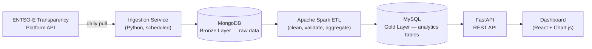
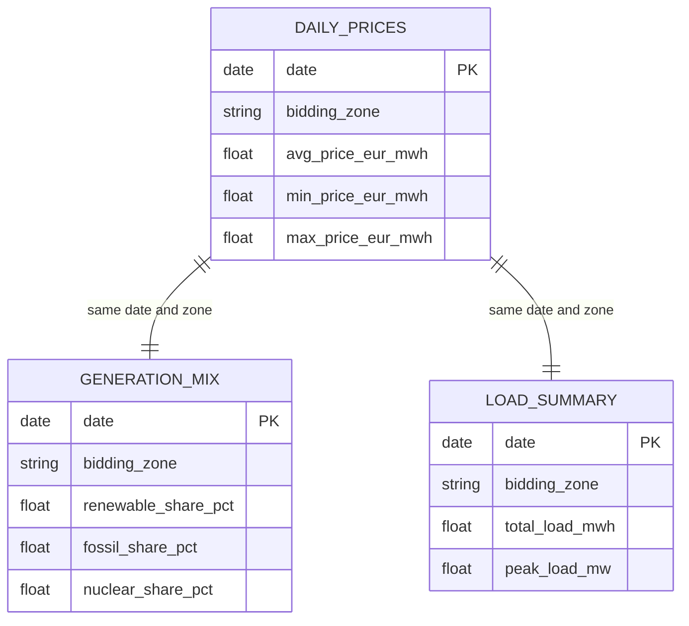
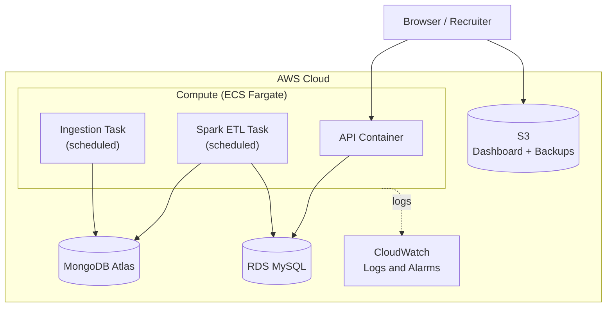

# GridPulse
### A European Electricity Market Data Engineering Platform

*Prepared by Georgios Zannis · Computer Engineer, University of Patras*

---

## 0. Quick Facts

| | |
|---|---|
| **Domain** | Energy / electricity market data |
| **Core skills demonstrated** | Data engineering, backend/API development, distributed processing (Spark), containerization, cloud deployment, CI/CD |
| **Primary stack** | Python, Apache Spark, MongoDB, MySQL, FastAPI, Docker, AWS |
| **Estimated timeline** | 8–10 weeks, part-time |
| **Data source** | ENTSO-E Transparency Platform (free, official EU electricity market data) |

---

## Table of Contents

1. [Elevator Pitch](#1-elevator-pitch)
2. [Motivation](#2-motivation--why-this-project)
3. [Goals & Learning Objectives](#3-goals--learning-objectives)
4. [System Architecture](#4-system-architecture)
5. [Data Pipeline Design](#5-data-pipeline-design-medallion-architecture)
6. [Data Source: ENTSO-E](#6-data-source-entso-e-transparency-platform)
7. [Database Schema](#7-database-schema)
8. [REST API Design](#8-rest-api-design)
9. [Dashboard](#9-dashboard)
10. [Containerization Strategy](#10-containerization-strategy)
11. [Cloud Deployment (AWS)](#11-cloud-deployment-aws)
12. [CI/CD Pipeline](#12-cicd-pipeline)
13. [Repository Structure](#13-repository-structure)
14. [Tech Stack Summary](#14-tech-stack-summary)
15. [Roadmap & Milestones](#15-roadmap--milestones)
16. [Stretch Goals](#16-stretch-goals)
17. [Why This Stands Out](#17-why-this-stands-out-interview-talking-points)
18. [Getting Started Checklist](#18-getting-started-checklist)

---

## 1. Elevator Pitch

**GridPulse** is an end-to-end data platform that ingests real electricity market data (day-ahead prices, load, and generation mix) for Greece and other European bidding zones, processes it through a distributed data pipeline, and serves it through a REST API and a live dashboard — fully containerized and deployed on the cloud.

In one sentence: *it takes raw, messy, real-world energy market data and turns it into a queryable, visualized, production-style product* — the same core problem data/software engineers solve at any company that deals with operational data.

---

## 2. Motivation — Why This Project

This project is a deliberate continuation of your diploma thesis (NILM — disaggregating household power consumption), but shifts focus from *machine learning on energy data* to *engineering the systems that move, store, and serve energy data at scale*. Together, the two projects tell a coherent story: **"I understand energy data both as a data scientist and as the engineer who builds the infrastructure around it."** That narrative consistency is genuinely rare in junior candidates and is exactly the kind of thing that makes an interviewer remember you.

It also directly addresses the gap identified earlier: hands-on Docker and cloud experience, on a project substantial enough to be a real portfolio centerpiece rather than a tutorial follow-along.

---

## 3. Goals & Learning Objectives

- Build a real, multi-service backend system — not a single script
- Practice the **Bronze/Silver/Gold** data pipeline pattern used across the data engineering industry
- Get hands-on with **Apache Spark** for actual transformation logic, not just a thesis-scale demo
- Design and document a clean **REST API**
- Containerize a multi-service application with **Docker Compose**
- Deploy a real system to **AWS**, including a managed database, container hosting, and object storage
- Set up a working **CI/CD pipeline** with GitHub Actions
- Produce documentation good enough that a stranger could read it and understand the system in five minutes

---

## 4. System Architecture



**Flow in plain words:** a scheduled ingestion job pulls raw market data from ENTSO-E and dumps it, mostly unmodified, into MongoDB. A Spark job then reads that raw data, cleans and aggregates it, and writes structured, query-ready tables into MySQL. A FastAPI service reads from MySQL and exposes it as a REST API, which the dashboard consumes.

---

## 5. Data Pipeline Design (Medallion Architecture)

This project follows the **Medallion Architecture** pattern (Bronze → Silver → Gold), a standard way data teams organize pipelines in industry:

| Layer | Storage | Contents | Purpose |
|---|---|---|---|
| **Bronze** | MongoDB | Raw API responses, minimally touched, timestamped | Audit trail, replay-ability if downstream logic changes |
| **Silver** | Spark (in-memory / temp Parquet) | Cleaned, deduplicated, type-validated records | Intermediate working layer |
| **Gold** | MySQL | Daily/weekly aggregates: avg/min/max price, renewable share, peak load | Fast, structured queries for the API and dashboard |

Framing it this way — and naming it as such in your README — signals to reviewers that you know current data engineering vocabulary, not just how to write a script that moves data from A to B.

---

## 6. Data Source: ENTSO-E Transparency Platform

The [ENTSO-E Transparency Platform](https://transparency.entsoe.eu) is the official, free, EU-mandated source for European electricity market data — covering day-ahead prices, actual generation by fuel type, load, and cross-border flows for nearly all of Europe.

**Access:**
- Register an account at transparency.entsoe.eu
- Email `transparency@entsoe.eu` with subject "Restful API access", including the email you registered with
- Once approved, generate a security token from your account settings
- Data is returned as XML (there are also unofficial Python wrappers like `entsoe-py` you can reference, though writing your own minimal client is better practice for this project)

**Key data to pull for Greece:**
- Day-ahead prices (Document type A44)
- Actual generation per production type (A75)
- Actual total load (A65)
- Greece's bidding zone EIC code is `10YGR-HTSO-----Y` — double-check this against the live Area list in the API guide before hardcoding it, since these codes are occasionally revised.

**A nice extension:** pull the same data for 2–3 neighboring countries (Italy, Bulgaria) to show cross-border price coupling — day-ahead prices across interconnected zones tend to converge, which makes for an interesting chart and a good talking point.

---

## 7. Database Schema

Simplified Gold-layer schema (MySQL):



Start with these three tables. Resist the urge to over-design the schema before you have real data flowing — it's much easier to extend a working schema than to perfect one on paper.

---

## 8. REST API Design

Built with **FastAPI** (Python) — chosen because it gives you automatic OpenAPI/Swagger docs for free, which itself becomes something to link in your portfolio.

| Method | Endpoint | Description |
|---|---|---|
| GET | `/api/v1/prices/latest` | Latest day-ahead price for a bidding zone |
| GET | `/api/v1/prices/history` | Historical daily price aggregates (`from`, `to`, `zone` params) |
| GET | `/api/v1/generation/mix` | Renewable/fossil/nuclear share for a given date |
| GET | `/api/v1/load/summary` | Total and peak load for a given date |
| GET | `/api/v1/health` | Health check — used by Docker/AWS to confirm the service is alive |
| GET | `/docs` | Auto-generated interactive API documentation (built into FastAPI) |

---

## 9. Dashboard

A simple frontend that plots price trends and generation mix over time. Two reasonable options, depending on how much time you want to invest:

- **React + Chart.js/Recharts** — more modern, more employable skill, steeper learning curve if you haven't used React before
- **Plain HTML + Chart.js** — faster to build, still looks clean, lets you focus your time on the data engineering side instead

Either is a legitimate choice. If your goal is maximum breadth of skills shown, go React; if your goal is finishing the whole pipeline end-to-end faster, go plain HTML.

---

## 10. Containerization Strategy

Each service gets its own `Dockerfile`; `docker-compose.yml` orchestrates them locally:

- `mongodb` — official MongoDB image
- `mysql` — official MySQL image
- `ingestion` — your Python ingestion service, run on a schedule
- `spark` — your PySpark ETL job (can run as a one-off batch container rather than a persistent service)
- `api` — your FastAPI service
- `dashboard` — static files served via nginx, or a dev server if using React
- `adminer` or `mongo-express` — optional, but genuinely useful for inspecting your databases locally during development

Running `docker-compose up` should bring up the entire system with one command — this is the single most convincing demo moment for anyone reviewing your repo.

---

## 11. Cloud Deployment (AWS)



- **MongoDB Atlas** (free tier) instead of self-hosting MongoDB — one less thing to manage, and it's the industry-standard way teams run MongoDB in production anyway
- **RDS (MySQL)** free tier for the Gold layer
- **ECS Fargate** to run your containers without managing EC2 instances directly — this is a more modern, more "hireable" skill than raw EC2, and avoids you having to patch/manage servers yourself
- **S3** to host the static dashboard build (and double as a backup location for Gold-layer exports)
- **CloudWatch** for logs and basic alerting — e.g., get notified if the ingestion job fails to run

---

## 12. CI/CD Pipeline

A GitHub Actions workflow (`.github/workflows/ci.yml`) that, on every push:

1. Lints the Python code
2. Runs unit tests (`pytest`) for the API and ingestion logic
3. Builds the Docker images
4. Pushes images to a registry (Docker Hub or AWS ECR)
5. *(Stretch)* auto-deploys to AWS on merges to `main`

Even without step 5, having a green CI badge on your README is a small detail that signals real engineering discipline.

---

## 13. Repository Structure

```
gridpulse/
├── ingestion/              # Pulls raw data from ENTSO-E
│   ├── entsoe_client.py
│   ├── ingest.py
│   └── Dockerfile
├── processing/              # PySpark ETL (Bronze → Silver → Gold)
│   ├── etl_job.py
│   └── Dockerfile
├── api/                     # FastAPI REST service
│   ├── main.py
│   ├── routers/
│   ├── models/
│   └── Dockerfile
├── dashboard/                # Frontend
│   └── ...
├── infra/
│   ├── docker-compose.yml
│   └── aws/                  # Deployment configs (stretch: Terraform)
├── docs/
│   ├── architecture.md
│   └── diagrams/
├── tests/
├── .github/workflows/ci.yml
├── .env.example
└── README.md
```

---

## 14. Tech Stack Summary

| Technology | Role in project | Already know it? |
|---|---|---|
| Python | Ingestion service, Spark jobs, API | Yes |
| Apache Spark | ETL / transformation layer | Yes (from thesis) |
| MongoDB | Bronze layer (raw storage) | Yes |
| MySQL | Gold layer (structured analytics) | Yes |
| FastAPI | REST API | New — small learning curve if you know Python |
| Docker / Docker Compose | Containerization | Basic — this project deepens it |
| AWS (ECS, RDS, S3, CloudWatch) | Cloud deployment | New — this is the main growth area |
| GitHub Actions | CI/CD | New |
| React or Chart.js | Dashboard | Partial (you know JS) |
| Mermaid / draw.io | Architecture diagrams | Yes |

---

## 15. Roadmap & Milestones

| Phase | Weeks | Focus |
|---|---|---|
| 0 | Week 0 | Repo scaffolding, ENTSO-E API key registration, Docker Compose skeleton |
| 1 | Weeks 1–2 | Ingestion service → raw data landing in MongoDB (Bronze) |
| 2 | Weeks 3–4 | Spark ETL job → cleaned, aggregated data in MySQL (Gold) |
| 3 | Week 5 | FastAPI endpoints + Swagger docs + basic tests |
| 4 | Week 6 | Dashboard (React or Chart.js) |
| 5 | Week 7 | Full local Docker Compose stack + polished setup instructions |
| 6 | Week 8 | AWS deployment (Atlas, RDS, ECS, S3) |
| 7 | Week 9 | CI/CD pipeline + CloudWatch monitoring |
| 8 | Week 10 | Documentation polish, demo GIF/video, LinkedIn Featured update |

---

## 16. Stretch Goals

- Swap the cron-based scheduling for **Apache Airflow** — a widely-requested data engineering skill
- Add a **price forecasting model** using your existing ML background (this would bridge GridPulse back to your thesis even more directly)
- Add **Terraform** so the AWS infrastructure is defined as code instead of clicked together manually
- Add lightweight **API key authentication**
- Add a **Slack or email alert** when negative electricity prices occur (a real, fascinating phenomenon on high-renewable grids, and a great story to tell in an interview)
- Compare Greece against 2–3 neighboring bidding zones to visualize cross-border price convergence

---

## 17. Why This Stands Out (Interview Talking Points)

- *"My thesis was about disaggregating energy consumption with ML — GridPulse is the natural next step: understanding the infrastructure that moves and serves energy data at scale."*
- *"I used the Medallion architecture (Bronze/Silver/Gold) to structure the pipeline, the same pattern used at most data-driven companies."*
- *"The whole system is containerized and deployed on AWS — `docker-compose up` brings up the entire stack locally in one command."*
- *"I built a CI pipeline so every push is automatically tested and built into a deployable image."*

---

## 18. Getting Started Checklist

Concrete first actions, in order:

1. Register at transparency.entsoe.eu and request RESTful API access
2. Create the GitHub repo (`gridpulse`) with the folder structure above
3. Write a throwaway Python script that successfully pulls **one day** of Greek day-ahead prices and prints it — this is your "hello world" for the whole project
4. Once that works, wrap it into the `ingestion/` service and connect it to a local MongoDB container
5. From there, follow the roadmap phase by phase

---

*This document is a living plan — expect the schema, endpoints, and roadmap to evolve once real data starts flowing. That's normal engineering, not a sign the plan was wrong.*
